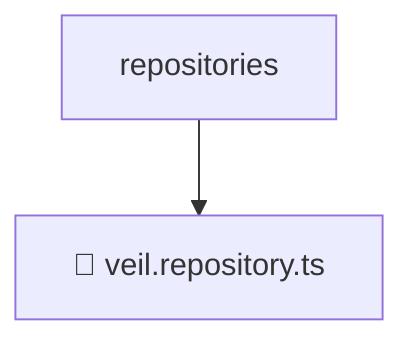

# 📂 REPOSITORIES

> 💎 **Mavluda Beauty - Luxury Professional Architecture**

### 📍 Breadcrumb Navigation
`. > backend > src > modules > veil > infrastructure > repositories`

## 🎯 PURPOSE
This directory encapsulates `Infrastructure` level functionality within the Mavluda Beauty ecosystem, ensuring proper separation of concerns and architectural transparency.

**FSD / Architecture Layer:** `Infrastructure`

## 🏗️ ARCHITECTURE


## 📄 FILE REGISTRY

| Item Name | Type | Responsibility | Key Aliases Used |
|-----------|------|----------------|------------------|
| `📄 veil.repository.ts` | `.ts` | General functionality | `@nestjs/common, @nestjs/mongoose, @common/utils/file-system` |

## 🔗 DEPENDENCIES
- `@common/utils/file-system`
- `@nestjs/common`
- `@nestjs/mongoose`

## 🛠️ USAGE
```typescript
// Example usage context
import { ... } from './veil.repository';

// Integrate veil.repository logic into your feature.
```
