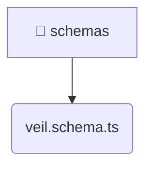

# [backend](/backend) / [src](/backend/src) / [modules](/backend/src/modules) / [veil](/backend/src/modules/veil) / [infrastructure](/backend/src/modules/veil/infrastructure) / [schemas](/backend/src/modules/veil/infrastructure/schemas)

## 🏷️ 📑 Schemas

### 🎯 PURPOSE
The `schemas` directory forms a critical foundation within the Mavluda Beauty ecosystem, meticulously orchestrating the schemas logic to ensure a seamless and premium experience. Rooted in the NestJS backend architecture, it delivers robust, high-performance operations tailored for high-end beauty and wedding services.

### 🏗️ ARCHITECTURE


### 📄 FILE REGISTRY
| File Name | Type | Responsibility | Key Aliases Used |
|---|---|---|---|
| `veil.schema.ts` | `ts` | Encapsulates premium logic and definitions for `veil.schema.ts`. | @nestjs/mongoose |


### 🔗 DEPENDENCIES
- `@nestjs/mongoose`

### 🛠️ USAGE
```typescript
// Seamlessly integrate schemas into your refined workflows:
import { /* exported members */ } from '@path/to/schemas';
```
