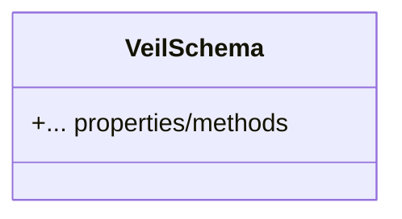
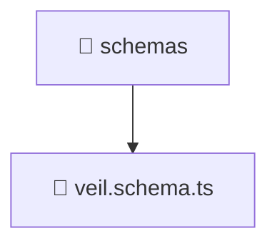

# 📄 Schemas Directory

[backend](/backend) > [src](/backend/src) > [modules](/backend/src/modules) > [veil](/backend/src/modules/veil) > [infrastructure](/backend/src/modules/veil/infrastructure) > [schemas](/backend/src/modules/veil/infrastructure/schemas)

## 🎯 Purpose
A high-level module handling `schemas` logic within the Mavluda Beauty ecosystem. This directory adheres to our "Luxury Professional" architectural standards.


## 🏗️ Architecture



## 📄 File Registry
| File Name | Type | Responsibility | Key Aliases Used |
|-----------|------|----------------|------------------|
| `veil.schema.ts` | TypeScript | Defines MongoDB data structure and validation. | @nestjs/mongoose |

## 🔗 Dependencies
- `@nestjs/mongoose`

## 🛠️ Usage
```typescript
// Architectural overview snippet
import { InternalLogic } from './internal-file';
// Ensure adherence to Hexagonal / FSD principles
```

## 📝 Existing Context
# 📁 schemas

[Root](/.) > [backend](/backend) > [src](/backend/src) > [modules](/backend/src/modules) > [veil](/backend/src/modules/veil) > [infrastructure](/backend/src/modules/veil/infrastructure) > [schemas](/backend/src/modules/veil/infrastructure/schemas)

## 🎯 Purpose
Delivering luxury-tier architectural components and high-performance logic for the **schemas** domain. This directory is a crucial part of the Mavluda Beauty full-stack ecosystem, ensuring seamless scalability, robust performance, and an elite digital experience.

## 🏗️ Architecture


## 📄 File Registry
| File Name | Type | Responsibility | Key Aliases Used |
|---|---|---|---|
| `veil.schema.ts` | TypeScript | Provides core logic and orchestration for veil.schema.ts. | @nestjs |

## 🔗 Dependencies
- `@nestjs/mongoose`
- `mongoose`

## 🛠️ Usage
```typescript
// Example usage within the Mavluda Beauty ecosystem
import { relevantMember } from './schemas';

// Integrate into the application architecture
relevantMember.execute();
```
