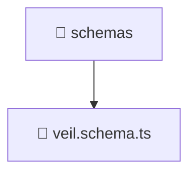

### 🧭 Breadcrumbs
[Root](/) > [backend](/backend) > [src](/backend/src) > [modules](/backend/src/modules) > [veil](/backend/src/modules/veil) > [infrastructure](/backend/src/modules/veil/infrastructure) > [schemas](/backend/src/modules/veil/infrastructure/schemas)

# 📁 Schemas Directory
**Architecture Layer:** Domain/Infrastructure Layer

## 🎯 Purpose
Provides luxury professional architectural implementation for the schemas module within the Mavluda Beauty ecosystem. Ensure robust functionality and elegant integration with the broader architecture.

## 🏗️ ARCHITECTURE


## 📄 FILE REGISTRY
| File Name | Type | Responsibility | Key Aliases Used |
|---|---|---|---|
| `veil.schema.ts` | TypeScript | Provides core logic and orchestration for veil.schema.ts. | @nestjs/mongoose |

## 🔗 DEPENDENCIES
- `@nestjs/mongoose`

## 🛠️ USAGE
```typescript
// Example architectural integration for schemas
// Utilize the exported members according to Mavluda Beauty's standard conventions.
```

---
*Maintained by Mavluda Beauty - Architecture & Engineering*

---
*Maintained by Mavluda Beauty - Architecture & Engineering*