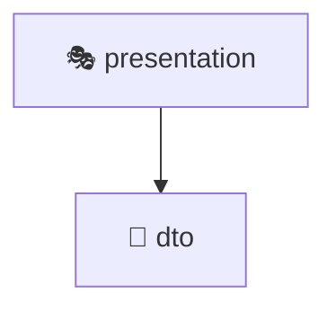

# 🎭 presentation

[Root](/.) / [backend](../../../..) / [src](../../..) / [modules](../..) / [veil](..) / [presentation](.)

## 🎯 Purpose
Delivering luxury-tier architectural components and high-performance logic for the **presentation** domain. This directory orchestrates precise operations within the Mavluda Beauty ecosystem, maintaining our elite standards of digital excellence.

## 🏗️ Architecture


## 📄 File Registry
| File Name | Type | Responsibility | Key Aliases Used |
|---|---|---|---|
| `veil.controller.ts` | TypeScript | API routing and request handling. | @nestjs |

## 🔗 Dependencies
- `@nestjs`

## 🛠️ Usage
```markdown
> This directory acts primarily as a structural container or logic module.
> To interact with its contents, import the relevant exported members from the `index.ts` or specifically targeted files.
```
