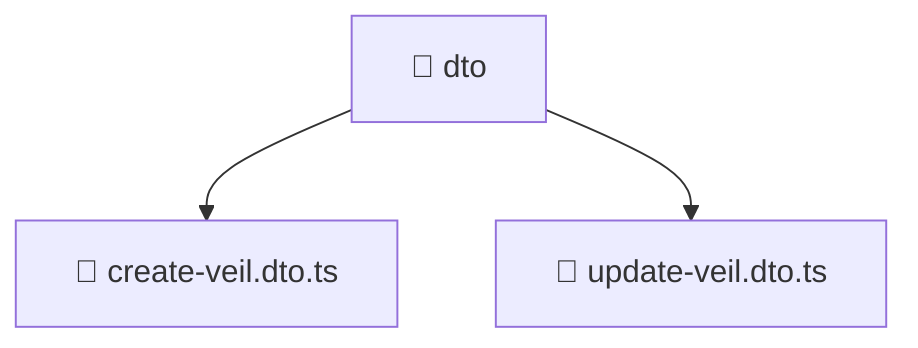

[Root](/.) > [backend](/backend) > [src](/backend/src) > [modules](/backend/src/modules) > [veil](/backend/src/modules/veil) > [presentation](/backend/src/modules/veil/presentation) > [dto](/backend/src/modules/veil/presentation/dto)

# 📁 Dto

## 🎯 Purpose
Delivering luxury-tier architectural components and high-performance logic for the **dto** domain. This directory is a crucial part of the Mavluda Beauty full-stack ecosystem, ensuring seamless scalability, robust performance, and an elite digital experience.

## 🏗️ Architecture


## 📄 File Registry
| File Name | Type | Responsibility | Key Aliases Used |
|---|---|---|---|
| `create-veil.dto.ts` | TypeScript | Provides core logic and orchestration for create-veil.dto.ts. | N/A |
| `update-veil.dto.ts` | TypeScript | Provides core logic and orchestration for update-veil.dto.ts. | @nestjs |

## 🔗 Dependencies
- `./create-veil.dto`, `@nestjs/mapped-types`, `class-transformer`, `class-validator`

## 🛠️ Usage
```typescript
// Example usage within the Mavluda Beauty ecosystem
import { relevantMember } from './core';

// Integrate into the application architecture
relevantMember.execute();
```