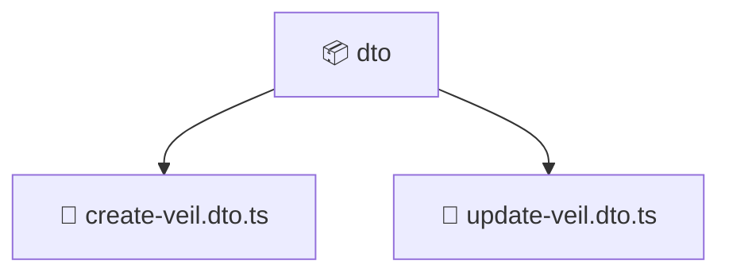

# 📦 Mavluda Beauty dto

[backend](/backend) / [src](/backend/src) / [modules](/backend/src/modules) / [veil](/backend/src/modules/veil) / [presentation](/backend/src/modules/veil/presentation) / [dto](/backend/src/modules/veil/presentation/dto)

## 🎯 Purpose
Delivering luxury-tier architectural components and high-performance logic for the **dto** domain. This directory is a crucial part of the Mavluda Beauty full-stack ecosystem, ensuring seamless scalability, robust performance, and an elite digital experience.

## 🏗️ Architecture


## 📄 File Registry
| File Name | Type | Responsibility | Key Aliases Used |
|---|---|---|---|
| `create-veil.dto.ts` | DTO | Defines expected data shapes for validation. | N/A |
| `update-veil.dto.ts` | DTO | Defines expected data shapes for validation. | `@nestjs/mapped-types` |


## 🔗 Dependencies
**Path Aliases:**
- `@nestjs/mapped-types`

**External Packages:**
- `class-validator`
- `class-transformer`


## 🛠️ Usage
```typescript
// Example integration for dto
// Import capabilities from this directory to enrich your modules.
```
> This directory provides specialized logic tailored to the Mavluda Beauty standard.
