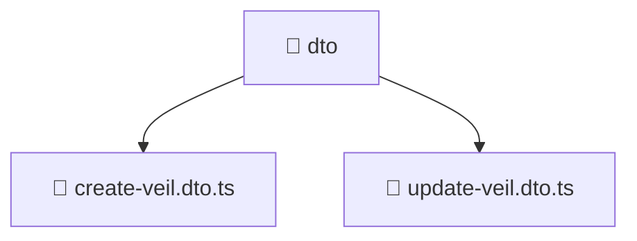

# 📁 Dto

[Root](../../../../../../) > [backend](../../../../../) > [src](../../../../) > [modules](../../../) > [veil](../../) > [presentation](../) > [dto](./)

## 🎯 Purpose
Delivering luxury-tier architectural components and high-performance logic for the **Dto** domain. This directory is a crucial part of the Mavluda Beauty full-stack ecosystem, ensuring seamless scalability, robust performance, and an elite digital experience.

**Architecture Layer:** Backend Infrastructure (Feature Sliced Design / Layered Architecture)

## 🏗️ Architecture


## 📄 File Registry
| File Name | Type | Responsibility | Key Aliases Used |
|---|---|---|---|
| `create-veil.dto.ts` | TypeScript | Core logic and utilities for this domain. | N/A |
| `update-veil.dto.ts` | TypeScript | Core logic and utilities for this domain. | @nestjs/mapped-types |


## 🔗 Dependencies
- `@nestjs/mapped-types`

## 🛠️ Usage
```markdown
> This directory acts primarily as a structural container or logic module.
> To interact with its contents, import the relevant exported members from the `index.ts` or specifically targeted files.
```
