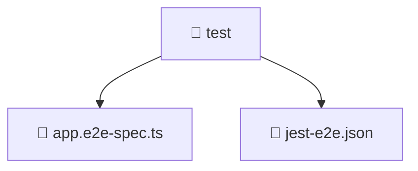

<!--
Mavluda Beauty - Luxury Professional Documentation
Generated for 100% Architectural Transparency
-->
[Home](../../README.md) > [backend](../README.md) > [test](./README.md)

# 📁 TEST Directory

## 🎯 PURPOSE
Manages the test module, providing robust and secure backend services for the Mavluda Beauty application.

## 🏗️ ARCHITECTURE


## 📄 FILE REGISTRY
| File Name | Type | Responsibility | Key Aliases Used |
|---|---|---|---|
| `app.e2e-spec.ts` | TypeScript | Core logic implementation. | @nestjs |
| `jest-e2e.json` | Configuration | Core logic implementation. | - |


## 🔗 DEPENDENCIES
- `@nestjs/testing`
- `@nestjs/common`
- `supertest`
- `supertest/types`
- `./../src/app.module`

## 🛠️ USAGE
```typescript
// Example placeholder for interacting with test
// Consult the individual files in the registry for specific APIs.
```
