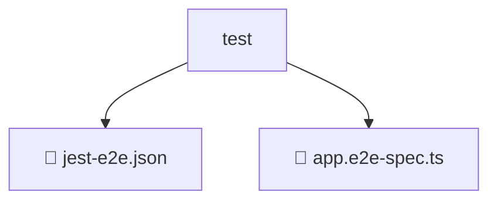

# 📂 TEST

> 💎 **Mavluda Beauty - Luxury Professional Architecture**

### 📍 Breadcrumb Navigation
`. > backend > test`

## 🎯 PURPOSE
This directory encapsulates `Backend Core/Infrastructure` level functionality within the Mavluda Beauty ecosystem, ensuring proper separation of concerns and architectural transparency.

**FSD / Architecture Layer:** `Backend Core/Infrastructure`

## 🏗️ ARCHITECTURE


## 📄 FILE REGISTRY

| Item Name | Type | Responsibility | Key Aliases Used |
|-----------|------|----------------|------------------|
| `📄 jest-e2e.json` | `.json` | General functionality | `None` |
| `📄 app.e2e-spec.ts` | `.ts` | General functionality | `@nestjs/common, @nestjs/testing` |

## 🔗 DEPENDENCIES
- `@nestjs/testing`
- `@nestjs/common`

## 🛠️ USAGE
```typescript
// Example usage context
import { ... } from './app.e2e-spec';

// Integrate app.e2e-spec logic into your feature.
```
