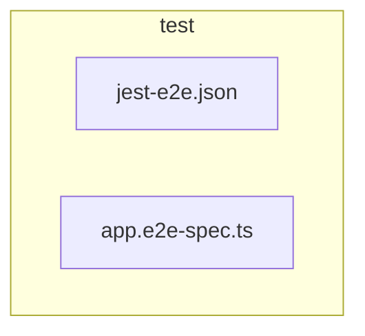

# 🧪 test

[backend](../README.md) > [test](README.md)

---

### 🎯 PURPOSE
Elevating the digital experience for the Mavluda Beauty ecosystem, this module manages the sophisticated Root / Operational Layer operations.

*FSD Layer:* **Root / Operational Layer**

---

### 🏗️ ARCHITECTURE



---

### 📄 FILE REGISTRY
| File Name | Type | Responsibility | Key Aliases Used |
|-----------|------|----------------|------------------|
| `jest-e2e.json` | Source | Handles source logic for Mavluda Beauty's luxury standards. | `None` |
| `app.e2e-spec.ts` | Source | Handles source logic for Mavluda Beauty's luxury standards. | `@nestjs` |

---

### 🔗 DEPENDENCIES
**Key Path Aliases Detected:** `@nestjs`

Notable imports:
- `supertest`
- `supertest/types`
- `./../src/app.module`
- `@nestjs/common`
- `@nestjs/testing`

---

### 🛠️ USAGE
To interact with this directory's luxurious logic, integrate its exported components or services directly into your feature modules. Ensure strict adherence to the Root / Operational Layer boundaries.

```typescript
// Example integration snippet
import { FeatureModule } from '@path/to/test';
```
