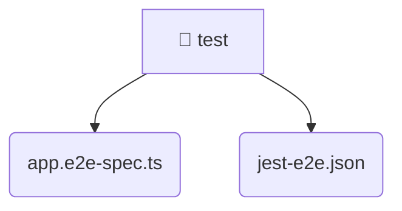

# [backend](/backend) / [test](/backend/test)

## 🏷️ 📁 Test

### 🎯 PURPOSE
The `test` directory forms a critical foundation within the Mavluda Beauty ecosystem, meticulously orchestrating the test logic to ensure a seamless and premium experience. Rooted in the NestJS backend architecture, it delivers robust, high-performance operations tailored for high-end beauty and wedding services.

### 🏗️ ARCHITECTURE


### 📄 FILE REGISTRY
| File Name | Type | Responsibility | Key Aliases Used |
|---|---|---|---|
| `app.e2e-spec.ts` | `ts` | Encapsulates premium logic and definitions for `app.e2e-spec.ts`. | @nestjs/testing, @nestjs/common |
| `jest-e2e.json` | `json` | Configuration and foundational asset. | None |


### 🔗 DEPENDENCIES
- `@nestjs/common`
- `@nestjs/testing`

### 🛠️ USAGE
```typescript
// Seamlessly integrate test into your refined workflows:
import { /* exported members */ } from '@path/to/test';
```
