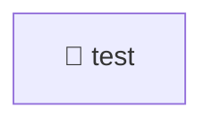

# 📁 test

[Root](/.) / [backend](..) / [test](.)

## 🎯 Purpose
Delivering luxury-tier architectural components and high-performance logic for the **test** domain. This directory orchestrates precise operations within the Mavluda Beauty ecosystem, maintaining our elite standards of digital excellence.

## 🏗️ Architecture


## 📄 File Registry
| File Name | Type | Responsibility | Key Aliases Used |
|---|---|---|---|
| `app.e2e-spec.ts` | TypeScript | Testing and quality assurance validation. | @nestjs |
| `jest-e2e.json` | Configuration | Configuration and environment settings. | N/A |

## 🔗 Dependencies
- `@nestjs`

## 🛠️ Usage
```markdown
> This directory acts primarily as a structural container or logic module.
> To interact with its contents, import the relevant exported members from the `index.ts` or specifically targeted files.
```
