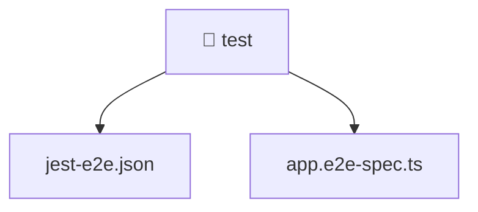

[🏠 Home](../../README.md) > [backend](../README.md) > [test](./README.md)

# 🧪 test

### 🎯 PURPOSE
Welcome to the exquisite **test** module of the Mavluda Beauty ecosystem. This directory handles specific domain assets and logic. It is designed adhering to our 'Luxury Professional' standards.

### 🏗️ ARCHITECTURE


### 📄 FILE REGISTRY
| File Name | Type | Responsibility | Key Aliases Used |
|---|---|---|---|
| `app.e2e-spec.ts` | TypeScript File | Provides logic and definitions for app.e2e-spec.ts. | @nestjs |
| `jest-e2e.json` | JSON Configuration | Provides logic and definitions for jest-e2e.json. | None |

### 🔗 DEPENDENCIES
- `@nestjs/common`
- `@nestjs/testing`
- `supertest`
- `supertest/types`

### 🛠️ USAGE
```typescript
// Example interaction or integration snippet
// Import members from test based on module boundaries
```
