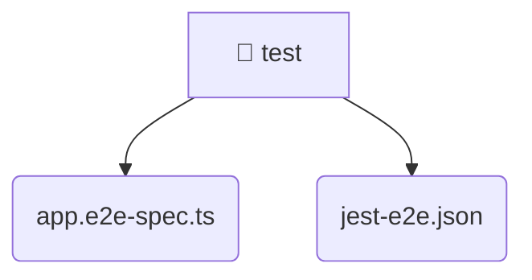

# [root](/) / [backend](/backend) / [test](/backend/test)

## 🏷️ 📁 Test

### 🎯 PURPOSE
The `test` directory forms a critical foundation within the Mavluda Beauty ecosystem, meticulously orchestrating the test logic to ensure a seamless and premium experience.

### 🏗️ ARCHITECTURE


### 📄 FILE REGISTRY
| File Name | Type | Responsibility | Key Aliases Used |
|---|---|---|---|
| `app.e2e-spec.ts` | `ts` | Core logic implementation. | @nestjs |
| `jest-e2e.json` | `json` | Configuration and foundational asset. | None |

### 🔗 DEPENDENCIES
- `./../src/app.module`
- `@nestjs/common`
- `@nestjs/testing`
- `supertest`
- `supertest/types`

### 🛠️ USAGE
```typescript
// Seamlessly integrate test into your refined workflows:
import { /* exported members */ } from '@path/to/test';
```
