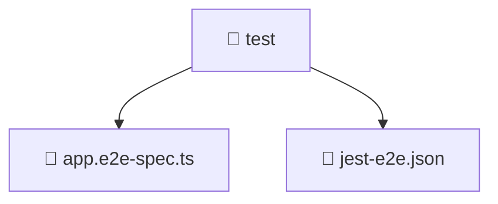

### 🧭 Breadcrumbs
[Root](/) > [backend](/backend) > [test](/backend/test)

# 📁 Test Directory
**Architecture Layer:** Domain/Infrastructure Layer

## 🎯 Purpose
Provides luxury professional architectural implementation for the test module within the Mavluda Beauty ecosystem. Ensure robust functionality and elegant integration with the broader architecture.

## 🏗️ ARCHITECTURE


## 📄 FILE REGISTRY
| File Name | Type | Responsibility | Key Aliases Used |
|---|---|---|---|
| `app.e2e-spec.ts` | TypeScript | Unit testing and quality assurance for app.e2e-spec.ts. | @nestjs/common, @nestjs/testing |
| `jest-e2e.json` | JSON Configuration | Provides core logic and orchestration for jest-e2e.json. | N/A |

## 🔗 DEPENDENCIES
- `@nestjs/common`
- `@nestjs/testing`

## 🛠️ USAGE
```typescript
// Example architectural integration for test
// Utilize the exported members according to Mavluda Beauty's standard conventions.
```

---
*Maintained by Mavluda Beauty - Architecture & Engineering*

---
*Maintained by Mavluda Beauty - Architecture & Engineering*