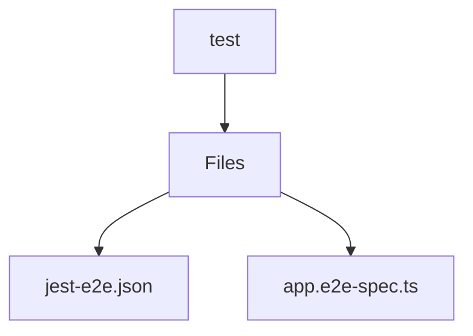

# 🏷️ Test Directory

> *Elegance, Precision, and Luxury Professionalism — The Mavluda Beauty Standard.*

## 🧭 Breadcrumb Navigation
[backend](/backend) ➔ [test](/backend/test)

## 🎯 Purpose
This directory encapsulates the essential architecture and logic for the **Test** domain within the Mavluda Beauty ecosystem. It serves as a foundational component ensuring robust, scalable, and elegant operations.

## 🏗️ Architecture


## 📄 File Registry
| File Name | Type | Responsibility | Key Aliases Used |
|---|---|---|---|
| `jest-e2e.json` | Configuration | Defines logic and structure for jest-e2e.json. | None |
| `app.e2e-spec.ts` | TypeScript | Defines logic and structure for app.e2e-spec.ts. | None |

## 🔗 Dependencies
- `@nestjs/common`
- `@nestjs/testing`
- `supertest`
- `supertest/types`

## 🛠️ Usage
```typescript
// This directory primarily serves organizational or static purposes.
// Reference its contents dynamically based on your feature requirements.
```
