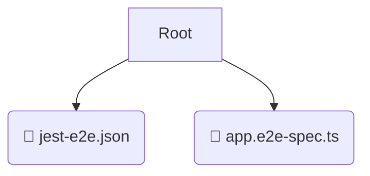

# 🧪 test

*Breadcrumbs:* [backend](/backend) / [test](/backend/test)

## 🎯 PURPOSE
This directory `test` is an integral part of the Mavluda Beauty ecosystem. It supports the scalable NestJS backend architecture.
This directory is meticulously maintained to uphold the 'Luxury Professional' standards of the Mavluda Beauty brand.

## 🏗️ ARCHITECTURE


## 📄 FILE REGISTRY
| File Name | Type | Responsibility | Key Aliases Used |
|---|---|---|---|
| `jest-e2e.json` | `json` | Core functionality | `None` |
| `app.e2e-spec.ts` | `ts` | Core functionality | `@nestjs/common, @nestjs/testing` |

## 🔗 DEPENDENCIES
- `@nestjs/common`
- `@nestjs/testing`

## 🛠️ USAGE
```typescript
// Example placeholder for interacting with the test module
import { example } from './jest-e2e.json';
```
