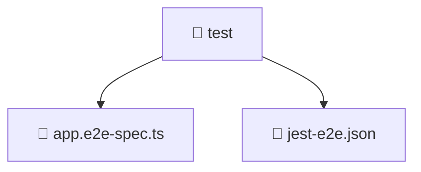

# 🧪 test

[Root](/.) > [backend](/backend) > [test](/backend/test)

## 🎯 Purpose
Delivering luxury-tier architectural components and high-performance logic for the **test** domain. This directory is a crucial part of the Mavluda Beauty full-stack ecosystem, ensuring seamless scalability, robust performance, and an elite digital experience.

## 🏗️ Architecture


## 📄 File Registry
| File Name | Type | Responsibility | Key Aliases Used |
|---|---|---|---|
| `app.e2e-spec.ts` | File | Core logic and utilities for this domain. | @nestjs |
| `jest-e2e.json` | File | Core logic and utilities for this domain. | N/A |


## 🔗 Dependencies
- `@nestjs/testing`
- `@nestjs/common`
- `supertest`
- `supertest/types`
- `./../src/app.module`

## 🛠️ Usage
```typescript
// Example usage within the Mavluda Beauty ecosystem
import { relevantMember } from './app.e2e-spec';

// Integrate into the application architecture
relevantMember.execute();
```
