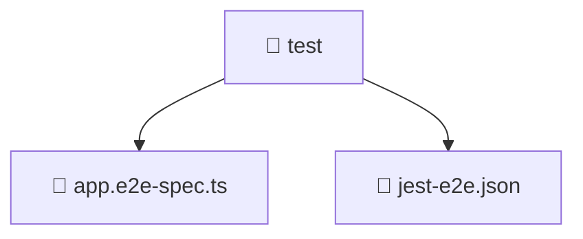

# 📁 Mavluda Beauty test

[backend](/backend) / [test](/backend/test)

## 🎯 Purpose
Delivering luxury-tier architectural components and high-performance logic for the **test** domain. This directory is a crucial part of the Mavluda Beauty full-stack ecosystem, ensuring seamless scalability, robust performance, and an elite digital experience.

## 🏗️ Architecture


## 📄 File Registry
| File Name | Type | Responsibility | Key Aliases Used |
|---|---|---|---|
| `app.e2e-spec.ts` | TypeScript Logic | Core logic and utilities for this domain. | `@nestjs/testing, @nestjs/common` |
| `jest-e2e.json` | Configuration | Project level settings and dependencies. | N/A |


## 🔗 Dependencies
**Path Aliases:**
- `@nestjs/testing`
- `@nestjs/common`

**External Packages:**
- `supertest`
- `supertest/types`


## 🛠️ Usage
```typescript
// Example integration for test
// Import capabilities from this directory to enrich your modules.
```
> This directory provides specialized logic tailored to the Mavluda Beauty standard.
