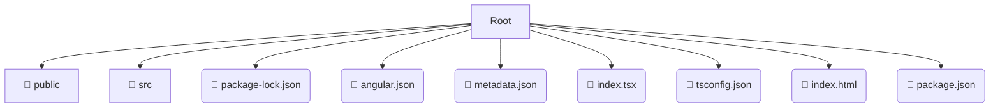

# 🎨 frontend

*Breadcrumbs:* [frontend](/frontend)

## 🎯 PURPOSE
This directory `frontend` is an integral part of the Mavluda Beauty ecosystem. It contributes to the Angular zoneless, signal-based frontend.
This directory is meticulously maintained to uphold the 'Luxury Professional' standards of the Mavluda Beauty brand.

## 🏗️ ARCHITECTURE


## 📄 FILE REGISTRY
| File Name | Type | Responsibility | Key Aliases Used |
|---|---|---|---|
| `package-lock.json` | `json` | Core functionality | `None` |
| `angular.json` | `json` | Core functionality | `None` |
| `metadata.json` | `json` | Core functionality | `None` |
| `index.tsx` | `tsx` | Core functionality | `@angular/platform-browser` |
| `tsconfig.json` | `json` | Core functionality | `None` |
| `index.html` | `html` | UI Template | `None` |
| `package.json` | `json` | Core functionality | `None` |

## 🔗 DEPENDENCIES
- `@angular/platform-browser`

## 🛠️ USAGE
```typescript
// Example placeholder for interacting with the frontend module
import { example } from './package-lock.json';
```
