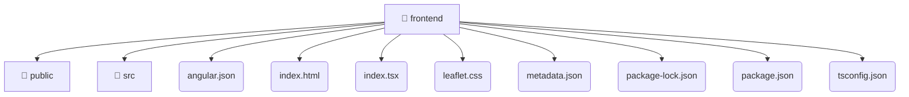

# [root](/) / [frontend](/frontend)

## 🏷️ 📁 Frontend

### 🎯 PURPOSE
The `frontend` directory forms a critical foundation within the Mavluda Beauty ecosystem, meticulously orchestrating the frontend logic to ensure a seamless and premium experience.

### 🏗️ ARCHITECTURE


### 📄 FILE REGISTRY
| File Name | Type | Responsibility | Key Aliases Used |
|---|---|---|---|
| `angular.json` | `json` | Configuration and foundational asset. | None |
| `index.html` | `html` | UI template and styling. | None |
| `index.tsx` | `tsx` | Configuration and foundational asset. | @angular |
| `leaflet.css` | `css` | UI template and styling. | None |
| `metadata.json` | `json` | Configuration and foundational asset. | None |
| `package-lock.json` | `json` | Configuration and foundational asset. | None |
| `package.json` | `json` | Configuration and foundational asset. | None |
| `tsconfig.json` | `json` | Configuration and foundational asset. | None |

### 🔗 DEPENDENCIES
- `./src/app.component`
- `./src/app/app.config`
- `@angular/platform-browser`

### 🛠️ USAGE
```typescript
// Seamlessly integrate frontend into your refined workflows:
import { /* exported members */ } from '@path/to/frontend';
```
