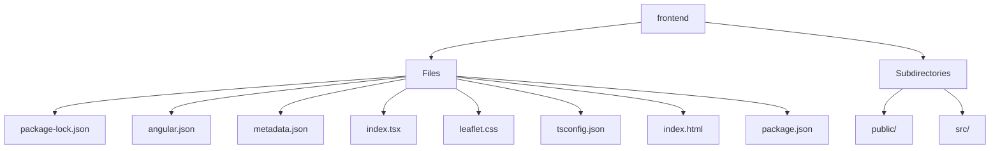

# 🏷️ Frontend Directory

> *Elegance, Precision, and Luxury Professionalism — The Mavluda Beauty Standard.*

## 🧭 Breadcrumb Navigation
[frontend](/frontend)

## 🎯 Purpose
This directory encapsulates the essential architecture and logic for the **Frontend** domain within the Mavluda Beauty ecosystem. It serves as a foundational component ensuring robust, scalable, and elegant operations.

## 🏗️ Architecture


## 📄 File Registry
| File Name | Type | Responsibility | Key Aliases Used |
|---|---|---|---|
| `package-lock.json` | Configuration | Defines logic and structure for package-lock.json. | None |
| `angular.json` | Configuration | Defines logic and structure for angular.json. | None |
| `metadata.json` | Configuration | Defines logic and structure for metadata.json. | None |
| `index.tsx` | File | Defines logic and structure for index.tsx. | None |
| `leaflet.css` | Stylesheet | Defines logic and structure for leaflet.css. | None |
| `tsconfig.json` | Configuration | Defines logic and structure for tsconfig.json. | @features, @widgets, @app, @pages, @entities, @env, @shared |
| `index.html` | HTML Template | Defines logic and structure for index.html. | None |
| `package.json` | Configuration | Defines logic and structure for package.json. | None |

## 🔗 Dependencies
- `@angular/platform-browser`

## 🛠️ Usage
```typescript
// This directory primarily serves organizational or static purposes.
// Reference its contents dynamically based on your feature requirements.
```
