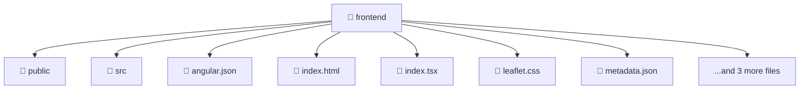

# 🎨 Frontend

[Root](../) > [frontend](./)

## 🎯 Purpose
Delivering luxury-tier architectural components and high-performance logic for the **Frontend** domain. This directory is a crucial part of the Mavluda Beauty full-stack ecosystem, ensuring seamless scalability, robust performance, and an elite digital experience.

## 🏗️ Architecture


## 📄 File Registry
| File Name | Type | Responsibility | Key Aliases Used |
|---|---|---|---|
| `angular.json` | JSON Config | Core logic and utilities for this domain. | N/A |
| `index.html` | HTML Template | Core logic and utilities for this domain. | N/A |
| `index.tsx` | File | Core logic and utilities for this domain. | @angular/platform-browser |
| `leaflet.css` | CSS Stylesheet | Core logic and utilities for this domain. | N/A |
| `metadata.json` | JSON Config | Core logic and utilities for this domain. | N/A |
| `package-lock.json` | JSON Config | Core logic and utilities for this domain. | N/A |
| `package.json` | JSON Config | Core logic and utilities for this domain. | N/A |
| `tsconfig.json` | JSON Config | Core logic and utilities for this domain. | N/A |


## 🔗 Dependencies
- `@angular/platform-browser`

## 🛠️ Usage
```markdown
> This directory acts primarily as a structural container or logic module.
> To interact with its contents, import the relevant exported members from the `index.ts` or specifically targeted files.
```
