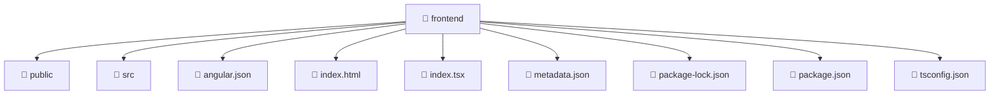

<!--
Mavluda Beauty - Luxury Professional Documentation
Generated for 100% Architectural Transparency
-->
[Home](../README.md) > [frontend](./README.md)

# 📁 FRONTEND Directory

## 🎯 PURPOSE
Structures and provides the UI layers and interactive capabilities for the frontend feature in the Mavluda Beauty platform.

## 🏗️ ARCHITECTURE


## 📄 FILE REGISTRY
| File Name | Type | Responsibility | Key Aliases Used |
|---|---|---|---|
| `angular.json` | Configuration | Core logic implementation. | - |
| `index.html` | HTML Template | Core logic implementation. | - |
| `index.tsx` | Code | Core logic implementation. | @angular |
| `metadata.json` | Configuration | Core logic implementation. | - |
| `package-lock.json` | Configuration | Core logic implementation. | - |
| `package.json` | Configuration | Core logic implementation. | - |
| `tsconfig.json` | Configuration | Core logic implementation. | - |


## 🔗 DEPENDENCIES
- `@angular/platform-browser`
- `./src/app.component`
- `./src/app/app.config`

## 🛠️ USAGE
```typescript
// Example placeholder for interacting with frontend
// Consult the individual files in the registry for specific APIs.
```
