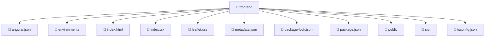

# 📁 frontend

[Root](/.) > [frontend](/frontend)

## 🎯 Purpose
Delivering luxury-tier architectural components and high-performance logic for the **frontend** domain. This directory is a crucial part of the Mavluda Beauty full-stack ecosystem, ensuring seamless scalability, robust performance, and an elite digital experience.

## 🏗️ Architecture


## 📄 File Registry
| File Name | Type | Responsibility | Key Aliases Used |
|---|---|---|---|
| `angular.json` | JSON | Handles logic and definitions for angular.json | None |
| `index.html` | HTML | Handles logic and definitions for index.html | None |
| `index.tsx` | TSX | Handles logic and definitions for index.tsx | @angular/platform-browser |
| `leaflet.css` | CSS | Handles logic and definitions for leaflet.css | None |
| `metadata.json` | JSON | Handles logic and definitions for metadata.json | None |
| `package-lock.json` | JSON | Handles logic and definitions for package-lock.json | None |
| `package.json` | JSON | Handles logic and definitions for package.json | None |
| `tsconfig.json` | JSON | Handles logic and definitions for tsconfig.json | None |

## 🔗 Dependencies
*(No specific external or cross-module dependencies detected)*

## 🛠️ Usage
```typescript
// Example usage within the Mavluda Beauty ecosystem
import { relevantMember } from './frontend';

// Integrate into the application architecture
relevantMember.execute();
```
