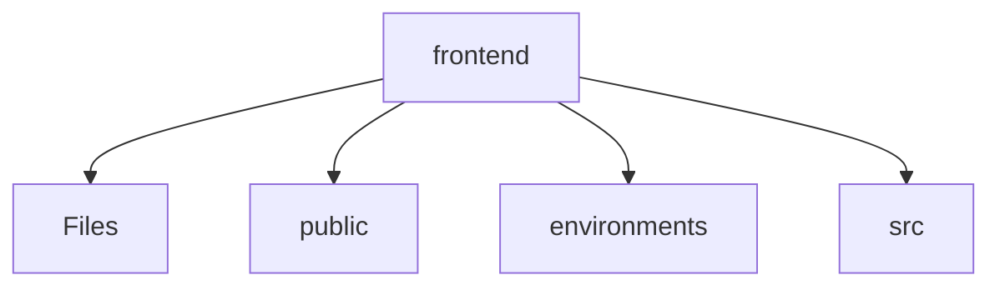
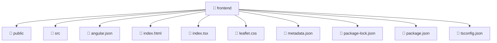

# 🎨 Frontend Directory

[frontend](/frontend)

## 🎯 Purpose
A high-level module handling `frontend` logic within the Mavluda Beauty ecosystem. This directory adheres to our "Luxury Professional" architectural standards.


## 🏗️ Architecture



## 📄 File Registry
| File Name | Type | Responsibility | Key Aliases Used |
|-----------|------|----------------|------------------|
| `angular.json` | File | Provides localized file definitions. | None |
| `index.html` | Template | Provides localized template definitions. | None |
| `index.tsx` | File | Provides localized file definitions. | @angular/platform-browser |
| `leaflet.css` | Style | Provides localized style definitions. | None |
| `metadata.json` | File | Provides localized file definitions. | None |
| `package-lock.json` | File | Provides localized file definitions. | None |
| `package.json` | File | Provides localized file definitions. | None |
| `tsconfig.json` | File | Provides localized file definitions. | None |

## 🔗 Dependencies
- `@angular/platform-browser`

## 🛠️ Usage
```typescript
// Architectural overview snippet
import { InternalLogic } from './internal-file';
// Ensure adherence to Hexagonal / FSD principles
```

## 📝 Existing Context
# 📁 frontend

[Root](/.) > [frontend](/frontend)

## 🎯 Purpose
Delivering luxury-tier architectural components and high-performance logic for the **frontend** domain. This directory is a crucial part of the Mavluda Beauty full-stack ecosystem, ensuring seamless scalability, robust performance, and an elite digital experience.

## 🏗️ Architecture


## 📄 File Registry
| File Name | Type | Responsibility | Key Aliases Used |
|---|---|---|---|
| `angular.json` | JSON Configuration | Provides core logic and orchestration for angular.json. | N/A |
| `index.html` | Template | Provides core logic and orchestration for index.html. | N/A |
| `index.tsx` | File | Provides core logic and orchestration for index.tsx. | @angular |
| `leaflet.css` | Stylesheet | Provides core logic and orchestration for leaflet.css. | N/A |
| `metadata.json` | JSON Configuration | Provides core logic and orchestration for metadata.json. | N/A |
| `package-lock.json` | JSON Configuration | Provides core logic and orchestration for package-lock.json. | N/A |
| `package.json` | JSON Configuration | Provides core logic and orchestration for package.json. | N/A |
| `tsconfig.json` | JSON Configuration | Provides core logic and orchestration for tsconfig.json. | N/A |

## 🔗 Dependencies
- `./src/app.component`
- `./src/app/app.config`
- `@angular/platform-browser`
- `leaflet/dist/leaflet.css`

## 🛠️ Usage
```typescript
// Example usage within the Mavluda Beauty ecosystem
import { relevantMember } from './frontend';

// Integrate into the application architecture
relevantMember.execute();
```
