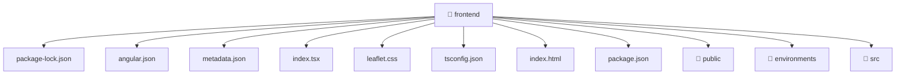

[🏠 Home](../README.md) > [frontend](./README.md)

# 🌐 frontend

### 🎯 PURPOSE
Welcome to the exquisite **frontend** module of the Mavluda Beauty ecosystem. This directory handles specific domain assets and logic. It is designed adhering to our 'Luxury Professional' standards.

### 🏗️ ARCHITECTURE


### 📄 FILE REGISTRY
| File Name | Type | Responsibility | Key Aliases Used |
|---|---|---|---|
| `angular.json` | JSON Configuration | Provides logic and definitions for angular.json. | None |
| `index.html` | HTML Template | Provides logic and definitions for index.html. | None |
| `index.tsx` | Asset / File | Provides logic and definitions for index.tsx. | @angular |
| `leaflet.css` | Stylesheet | Provides logic and definitions for leaflet.css. | None |
| `metadata.json` | JSON Configuration | Provides logic and definitions for metadata.json. | None |
| `package-lock.json` | JSON Configuration | Provides logic and definitions for package-lock.json. | None |
| `package.json` | JSON Configuration | Provides logic and definitions for package.json. | None |
| `tsconfig.json` | JSON Configuration | Provides logic and definitions for tsconfig.json. | None |

### 🔗 DEPENDENCIES
- `@angular/platform-browser`

### 🛠️ USAGE
```typescript
// Example interaction or integration snippet
// Import members from frontend based on module boundaries
```
