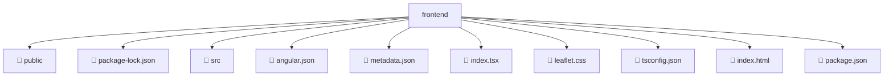

# 📂 FRONTEND

> 💎 **Mavluda Beauty - Luxury Professional Architecture**

### 📍 Breadcrumb Navigation
`. > frontend`

## 🎯 PURPOSE
This directory encapsulates `General` level functionality within the Mavluda Beauty ecosystem, ensuring proper separation of concerns and architectural transparency.

**FSD / Architecture Layer:** `General`

## 🏗️ ARCHITECTURE


## 📄 FILE REGISTRY

| Item Name | Type | Responsibility | Key Aliases Used |
|-----------|------|----------------|------------------|
| `📁 public` | `Directory` | Subdirectory logic grouping | `None` |
| `📄 package-lock.json` | `.json` | General functionality | `None` |
| `📁 src` | `Directory` | Subdirectory logic grouping | `None` |
| `📄 angular.json` | `.json` | General functionality | `None` |
| `📄 metadata.json` | `.json` | General functionality | `None` |
| `📄 index.tsx` | `.tsx` | General functionality | `@angular/platform-browser` |
| `📄 leaflet.css` | `.css` | General functionality | `None` |
| `📄 tsconfig.json` | `.json` | General functionality | `None` |
| `📄 index.html` | `.html` | General functionality | `None` |
| `📄 package.json` | `.json` | General functionality | `None` |

## 🔗 DEPENDENCIES
- `@angular/platform-browser`

## 🛠️ USAGE
```typescript
// Example usage context
import { ... } from './indexx';

// Integrate indexx logic into your feature.
```
