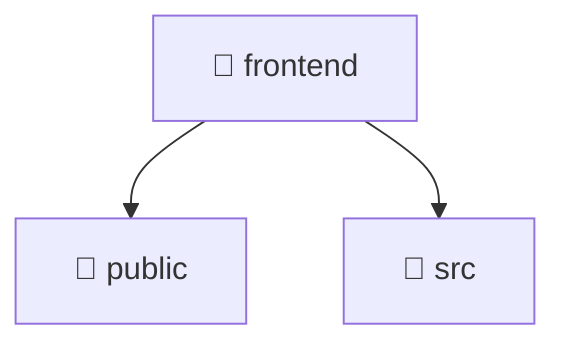

# 🎨 frontend

[Root](/.) / [frontend](.)

## 🎯 Purpose
Delivering luxury-tier architectural components and high-performance logic for the **frontend** domain. This directory orchestrates precise operations within the Mavluda Beauty ecosystem, maintaining our elite standards of digital excellence.

## 🏗️ Architecture


## 📄 File Registry
| File Name | Type | Responsibility | Key Aliases Used |
|---|---|---|---|
| `angular.json` | Configuration | Configuration and environment settings. | N/A |
| `index.html` | Template | Component template structural layout. | N/A |
| `index.tsx` | File | Core logic and utilities for this domain. | N/A |
| `leaflet.css` | Styles | Luxury styling and brand aesthetics. | N/A |
| `metadata.json` | Configuration | Configuration and environment settings. | N/A |
| `package-lock.json` | Configuration | Configuration and environment settings. | N/A |
| `package.json` | Configuration | Configuration and environment settings. | N/A |
| `tsconfig.json` | Configuration | Configuration and environment settings. | N/A |

## 🔗 Dependencies
*No internal path aliases detected in this directory.*

## 🛠️ Usage
```markdown
> This directory acts primarily as a structural container or logic module.
> To interact with its contents, import the relevant exported members from the `index.ts` or specifically targeted files.
```
