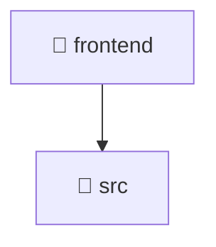

# 🎨 frontend

[Root](/.) > [frontend](/frontend)

## 🎯 Purpose
Delivering luxury-tier architectural components and high-performance logic for the **frontend** domain. This directory is a crucial part of the Mavluda Beauty full-stack ecosystem, ensuring seamless scalability, robust performance, and an elite digital experience.

## 🏗️ Architecture


## 📄 File Registry
| File Name | Type | Responsibility | Key Aliases Used |
|---|---|---|---|
| `angular.json` | File | Core logic and utilities for this domain. | N/A |
| `index.html` | Template | Visual layout and structural HTML. | N/A |
| `leaflet.css` | Stylesheet | Luxury styling and layout logic. | N/A |
| `metadata.json` | File | Core logic and utilities for this domain. | N/A |
| `package-lock.json` | File | Core logic and utilities for this domain. | N/A |
| `package.json` | Manifest | Project level settings and dependencies. | N/A |
| `tsconfig.json` | File | Core logic and utilities for this domain. | N/A |


## 🔗 Dependencies
- _No external or internal dependencies detected._

## 🛠️ Usage
```html
<!-- Example integration within Mavluda Beauty layouts -->
<!-- Rendered structural view -->
<div class="luxury-container">
  <!-- Content goes here -->
</div>
```
