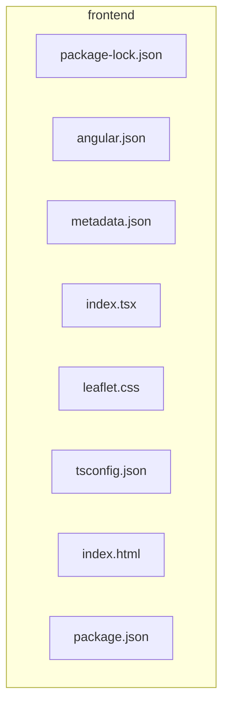

# 💻 frontend

[frontend](README.md)

---

### 🎯 PURPOSE
Elevating the digital experience for the Mavluda Beauty ecosystem, this module manages the sophisticated Root / Operational Layer operations.

*FSD Layer:* **Root / Operational Layer**

---

### 🏗️ ARCHITECTURE



---

### 📄 FILE REGISTRY
| File Name | Type | Responsibility | Key Aliases Used |
|-----------|------|----------------|------------------|
| `package-lock.json` | Source | Handles source logic for Mavluda Beauty's luxury standards. | `None` |
| `angular.json` | Source | Handles source logic for Mavluda Beauty's luxury standards. | `None` |
| `metadata.json` | Source | Handles source logic for Mavluda Beauty's luxury standards. | `None` |
| `index.tsx` | Source | Handles source logic for Mavluda Beauty's luxury standards. | `@angular` |
| `leaflet.css` | Styles | Handles styles logic for Mavluda Beauty's luxury standards. | `None` |
| `tsconfig.json` | Source | Handles source logic for Mavluda Beauty's luxury standards. | `None` |
| `index.html` | Template | Handles template logic for Mavluda Beauty's luxury standards. | `None` |
| `package.json` | Source | Handles source logic for Mavluda Beauty's luxury standards. | `None` |

---

### 🔗 DEPENDENCIES
**Key Path Aliases Detected:** `@angular`

Notable imports:
- `./src/app/app.config`
- `leaflet/dist/leaflet.css`
- `./src/app.component`
- `@angular/platform-browser`

---

### 🛠️ USAGE
To interact with this directory's luxurious logic, integrate its exported components or services directly into your feature modules. Ensure strict adherence to the Root / Operational Layer boundaries.

```typescript
// Example integration snippet
import { FeatureModule } from '@path/to/frontend';
```
