### 🧭 Breadcrumbs
[Root](/) > [frontend](/frontend)

# 📁 Frontend Directory
**Architecture Layer:** Domain/Infrastructure Layer

## 🎯 Purpose
Provides luxury professional architectural implementation for the frontend module within the Mavluda Beauty ecosystem. Ensure robust functionality and elegant integration with the broader architecture.

## 🏗️ ARCHITECTURE

```mermaid
graph TD
  f_Root_frontend["📁 frontend"]
  f_angular_json["📄 angular.json"]
  f_Root_frontend --> f_angular_json
  f_index_html["📄 index.html"]
  f_Root_frontend --> f_index_html
  f_index_tsx["📄 index.tsx"]
  f_Root_frontend --> f_index_tsx
  f_leaflet_css["📄 leaflet.css"]
  f_Root_frontend --> f_leaflet_css
  f_metadata_json["📄 metadata.json"]
  f_Root_frontend --> f_metadata_json
  f_package_lock_json["📄 package-lock.json"]
  f_Root_frontend --> f_package_lock_json
  f_package_json["📄 package.json"]
  f_Root_frontend --> f_package_json
  f_tsconfig_json["📄 tsconfig.json"]
  f_Root_frontend --> f_tsconfig_json
  f_Dir_public["📁 public"]
  f_Root_frontend --> f_Dir_public
  f_Dir_environments["📁 environments"]
  f_Root_frontend --> f_Dir_environments
  f_Dir_src["📁 src"]
  f_Root_frontend --> f_Dir_src
```

## 📄 FILE REGISTRY
| File Name | Type | Responsibility | Key Aliases Used |
|---|---|---|---|
| `angular.json` | JSON Configuration | Provides core logic and orchestration for angular.json. | N/A |
| `index.html` | HTML Template | Provides core logic and orchestration for index.html. | N/A |
| `index.tsx` | File | Provides core logic and orchestration for index.tsx. | N/A |
| `leaflet.css` | Stylesheet | Provides core logic and orchestration for leaflet.css. | N/A |
| `metadata.json` | JSON Configuration | Provides core logic and orchestration for metadata.json. | N/A |
| `package-lock.json` | JSON Configuration | Provides core logic and orchestration for package-lock.json. | N/A |
| `package.json` | JSON Configuration | Provides core logic and orchestration for package.json. | N/A |
| `tsconfig.json` | JSON Configuration | Provides core logic and orchestration for tsconfig.json. | N/A |

## 🔗 DEPENDENCIES
*No internal path alias dependencies explicitly resolved in this directory.*

## 🛠️ USAGE
Review the files in this directory for `frontend` integration and styling standards.

---
*Maintained by Mavluda Beauty - Architecture & Engineering*

---
*Maintained by Mavluda Beauty - Architecture & Engineering*