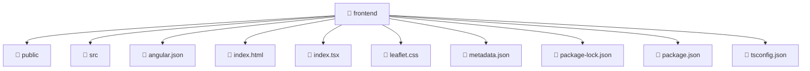

# 📁 frontend

[Root](/.) > [frontend](/frontend)

## 🎯 Purpose
Frontend UI components containing template structures, styling, and specific behavioral logic.

## 🏗️ Architecture


## 📄 File Registry
| File Name | Type | Responsibility | Key Aliases Used |
|---|---|---|---|
| `angular.json` | JSON Configuration | Provides core logic and orchestration for angular.json. | N/A |
| `index.html` | Template | Provides core logic and orchestration for index.html. | N/A |
| `index.tsx` | File | Provides core logic and orchestration for index.tsx. | @angular |
| `leaflet.css` | Stylesheet | Provides core logic and orchestration for leaflet.css. | N/A |
| `metadata.json` | JSON Configuration | Provides core logic and orchestration for metadata.json. | N/A |
| `package-lock.json` | JSON Configuration | Provides core logic and orchestration for package-lock.json. | N/A |
| `package.json` | JSON Configuration | Provides core logic and orchestration for package.json. | N/A |
| `tsconfig.json` | JSON Configuration | Provides core logic and orchestration for tsconfig.json. | N/A |

## 🔗 Dependencies
- `./src/app.component`
- `./src/app/app.config`
- `@angular/platform-browser`
- `leaflet/dist/leaflet.css`

## 🛠️ Usage
```html
<!-- Example usage in a parent component template -->
<app-component-selector></app-component-selector>
```
