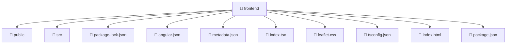

# 📁 frontend

[Root](/.) > [frontend](/frontend)

## 🎯 Purpose
Delivering luxury-tier architectural components and high-performance logic for the **frontend** domain. This directory is a crucial part of the Mavluda Beauty full-stack ecosystem, ensuring seamless scalability, robust performance, and an elite digital experience.

## 🏗️ Architecture


## 📄 File Registry
| File Name | Type | Responsibility | Key Aliases Used |
|---|---|---|---|
| `angular.json` | Config/JSON | Provides core logic and orchestration for angular.json. | N/A |
| `index.html` | Template | Provides core logic and orchestration for index.html. | N/A |
| `index.tsx` | TypeScript | Provides core logic and orchestration for index.tsx. | @angular |
| `leaflet.css` | Style | Provides core logic and orchestration for leaflet.css. | N/A |
| `metadata.json` | Config/JSON | Provides core logic and orchestration for metadata.json. | N/A |
| `package-lock.json` | Config/JSON | Provides core logic and orchestration for package-lock.json. | N/A |
| `package.json` | Config/JSON | Provides core logic and orchestration for package.json. | N/A |
| `tsconfig.json` | Config/JSON | Provides core logic and orchestration for tsconfig.json. | N/A |

## 🔗 Dependencies
- `@angular/platform-browser`
- `leaflet/dist/leaflet.css`

## 🛠️ Usage
```typescript
// Example usage within the Mavluda Beauty ecosystem
import { relevantMember } from './core';

// Integrate into the application architecture
relevantMember.execute();
```
