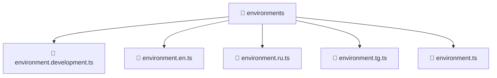

### 🧭 Breadcrumbs
[Root](/) > [frontend](/frontend) > [environments](/frontend/environments)

# 📁 Environments Directory
**Architecture Layer:** Domain/Infrastructure Layer

## 🎯 Purpose
Provides luxury professional architectural implementation for the environments module within the Mavluda Beauty ecosystem. Ensure robust functionality and elegant integration with the broader architecture.

## 🏗️ ARCHITECTURE


## 📄 FILE REGISTRY
| File Name | Type | Responsibility | Key Aliases Used |
|---|---|---|---|
| `environment.development.ts` | TypeScript | Utility or configuration file. | N/A |
| `environment.en.ts` | TypeScript | Utility or configuration file. | N/A |
| `environment.ru.ts` | TypeScript | Utility or configuration file. | N/A |
| `environment.tg.ts` | TypeScript | Utility or configuration file. | N/A |
| `environment.ts` | TypeScript | Utility or configuration file. | N/A |

## 🔗 DEPENDENCIES
*No internal path alias dependencies explicitly resolved in this directory.*

## 🛠️ USAGE
```typescript
// Example architectural integration for environments
// Utilize the exported members according to Mavluda Beauty's standard conventions.
```

---
*Maintained by Mavluda Beauty - Architecture & Engineering*

---
*Maintained by Mavluda Beauty - Architecture & Engineering*