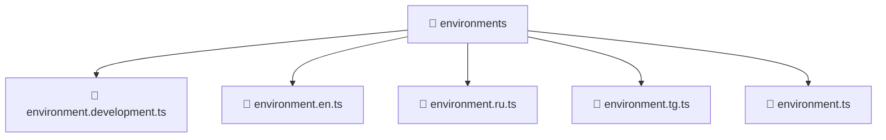

[Root](/.) > [frontend](/frontend) > [environments](/frontend/environments)

# 📁 Environments

## 🎯 Purpose
Delivering luxury-tier architectural components and high-performance logic for the **environments** domain. This directory is a crucial part of the Mavluda Beauty full-stack ecosystem, ensuring seamless scalability, robust performance, and an elite digital experience.

## 🏗️ Architecture


## 📄 File Registry
| File Name | Type | Responsibility | Key Aliases Used |
|---|---|---|---|
| `environment.development.ts` | TypeScript | Provides core logic and orchestration for environment.development.ts. | N/A |
| `environment.en.ts` | TypeScript | Provides core logic and orchestration for environment.en.ts. | N/A |
| `environment.ru.ts` | TypeScript | Provides core logic and orchestration for environment.ru.ts. | N/A |
| `environment.tg.ts` | TypeScript | Provides core logic and orchestration for environment.tg.ts. | N/A |
| `environment.ts` | TypeScript | Provides core logic and orchestration for environment.ts. | N/A |

## 🔗 Dependencies
- `./environment.development`

## 🛠️ Usage
```typescript
// Example usage within the Mavluda Beauty ecosystem
import { relevantMember } from './core';

// Integrate into the application architecture
relevantMember.execute();
```