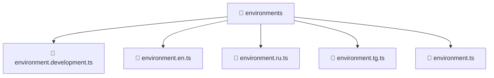

# 📁 environments

[Root](/.) > [frontend](/frontend) > [environments](/frontend/environments)

## 🎯 Purpose
Delivering luxury-tier architectural components and high-performance logic for the **environments** domain. This directory is a crucial part of the Mavluda Beauty full-stack ecosystem, ensuring seamless scalability, robust performance, and an elite digital experience.

## 🏗️ Architecture


## 📄 File Registry
| File Name | Type | Responsibility | Key Aliases Used |
|---|---|---|---|
| `environment.development.ts` | TypeScript | Handles logic and definitions for environment.development.ts | None |
| `environment.en.ts` | TypeScript | Handles logic and definitions for environment.en.ts | None |
| `environment.ru.ts` | TypeScript | Handles logic and definitions for environment.ru.ts | None |
| `environment.tg.ts` | TypeScript | Handles logic and definitions for environment.tg.ts | None |
| `environment.ts` | TypeScript | Handles logic and definitions for environment.ts | None |

## 🔗 Dependencies
- `./environment.development`

## 🛠️ Usage
```typescript
// Example usage within the Mavluda Beauty ecosystem
import { relevantMember } from './environments';

// Integrate into the application architecture
relevantMember.execute();
```
