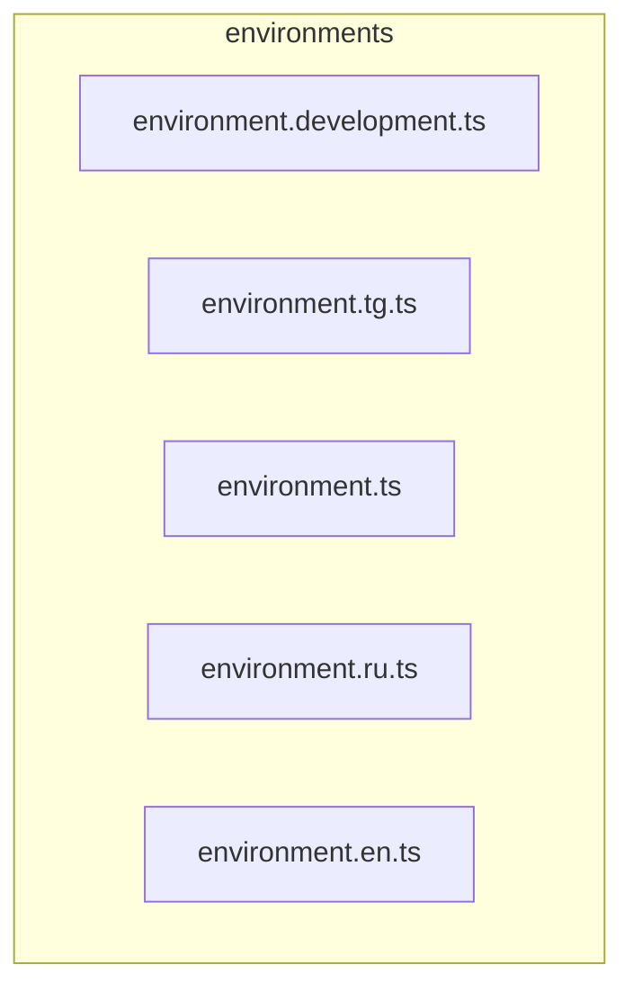

# 📁 environments

[frontend](../README.md) > [environments](README.md)

---

### 🎯 PURPOSE
Elevating the digital experience for the Mavluda Beauty ecosystem, this module manages the sophisticated Root / Operational Layer operations.

*FSD Layer:* **Root / Operational Layer**

---

### 🏗️ ARCHITECTURE



---

### 📄 FILE REGISTRY
| File Name | Type | Responsibility | Key Aliases Used |
|-----------|------|----------------|------------------|
| `environment.development.ts` | Source | Handles source logic for Mavluda Beauty's luxury standards. | `None` |
| `environment.tg.ts` | Source | Handles source logic for Mavluda Beauty's luxury standards. | `None` |
| `environment.ts` | Source | Handles source logic for Mavluda Beauty's luxury standards. | `None` |
| `environment.ru.ts` | Source | Handles source logic for Mavluda Beauty's luxury standards. | `None` |
| `environment.en.ts` | Source | Handles source logic for Mavluda Beauty's luxury standards. | `None` |

---

### 🔗 DEPENDENCIES
Notable imports:
- `./environment.development`

---

### 🛠️ USAGE
To interact with this directory's luxurious logic, integrate its exported components or services directly into your feature modules. Ensure strict adherence to the Root / Operational Layer boundaries.

```typescript
// Example integration snippet
import { FeatureModule } from '@path/to/environments';
```
