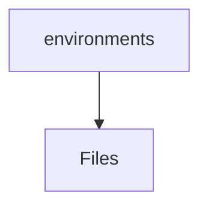

# 🌍 Environments Directory

[frontend](/frontend) > [environments](/frontend/environments)

## 🎯 Purpose
A high-level module handling `environments` logic within the Mavluda Beauty ecosystem. This directory adheres to our "Luxury Professional" architectural standards.


## 🏗️ Architecture



## 📄 File Registry
| File Name | Type | Responsibility | Key Aliases Used |
|-----------|------|----------------|------------------|
| `environment.development.ts` | TypeScript | Provides localized typescript definitions. | None |
| `environment.en.ts` | TypeScript | Provides localized typescript definitions. | None |
| `environment.ru.ts` | TypeScript | Provides localized typescript definitions. | None |
| `environment.tg.ts` | TypeScript | Provides localized typescript definitions. | None |
| `environment.ts` | TypeScript | Provides localized typescript definitions. | None |

## 🔗 Dependencies
- No major internal/external path aliases detected.

## 🛠️ Usage
```typescript
// Architectural overview snippet
import { InternalLogic } from './internal-file';
// Ensure adherence to Hexagonal / FSD principles
```
