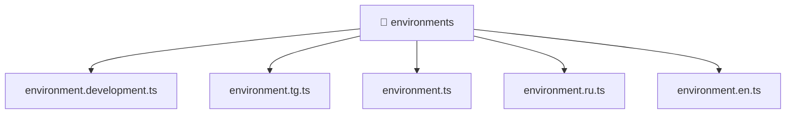

[🏠 Home](../../README.md) > [frontend](../README.md) > [environments](./README.md)

# 📁 environments

### 🎯 PURPOSE
Welcome to the exquisite **environments** module of the Mavluda Beauty ecosystem. This directory handles specific domain assets and logic. It is designed adhering to our 'Luxury Professional' standards.

### 🏗️ ARCHITECTURE


### 📄 FILE REGISTRY
| File Name | Type | Responsibility | Key Aliases Used |
|---|---|---|---|
| `environment.development.ts` | TypeScript File | Defines interfaces/types: Environment. | None |
| `environment.en.ts` | TypeScript File | Provides logic and definitions for environment.en.ts. | None |
| `environment.ru.ts` | TypeScript File | Provides logic and definitions for environment.ru.ts. | None |
| `environment.tg.ts` | TypeScript File | Provides logic and definitions for environment.tg.ts. | None |
| `environment.ts` | TypeScript File | Provides logic and definitions for environment.ts. | None |

### 🔗 DEPENDENCIES
No external or alias dependencies.

### 🛠️ USAGE
```typescript
// Example interaction or integration snippet
// Import members from environments based on module boundaries
```
