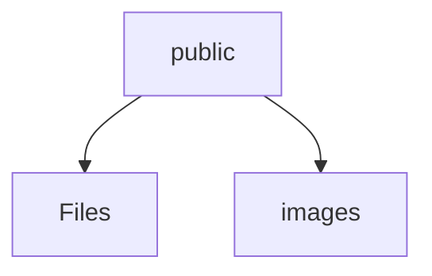
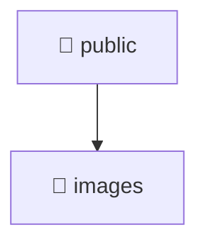

# 🌐 Public Directory

[frontend](/frontend) > [public](/frontend/public)

## 🎯 Purpose
A high-level module handling `public` logic within the Mavluda Beauty ecosystem. This directory adheres to our "Luxury Professional" architectural standards.


## 🏗️ Architecture



## 📄 File Registry
| File Name | Type | Responsibility | Key Aliases Used |
|-----------|------|----------------|------------------|

## 🔗 Dependencies
- No major internal/external path aliases detected.

## 🛠️ Usage
```typescript
// Architectural overview snippet
import { InternalLogic } from './internal-file';
// Ensure adherence to Hexagonal / FSD principles
```

## 📝 Existing Context
# 📁 public

[Root](/.) > [frontend](/frontend) > [public](/frontend/public)

## 🎯 Purpose
Delivering luxury-tier architectural components and high-performance logic for the **public** domain. This directory is a crucial part of the Mavluda Beauty full-stack ecosystem, ensuring seamless scalability, robust performance, and an elite digital experience.

## 🏗️ Architecture


## 📄 File Registry
*No relevant files in this directory.*

## 🔗 Dependencies
- No external dependencies.

## 🛠️ Usage
```typescript
// Example usage within the Mavluda Beauty ecosystem
import { relevantMember } from './public';

// Integrate into the application architecture
relevantMember.execute();
```
