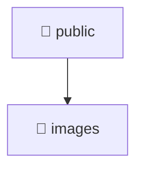

# 📁 public

[Root](/.) > [frontend](/frontend) > [public](/frontend/public)

## 🎯 Purpose
Static assets, images, icons, and public resources served directly to the client.

## 🏗️ Architecture


## 📄 File Registry
| File Name | Type | Responsibility | Key Aliases Used |
|---|---|---|---|

## 🔗 Dependencies
- No external dependencies.

## 🛠️ Usage
```html
<!-- Example reference in a template -->

```
