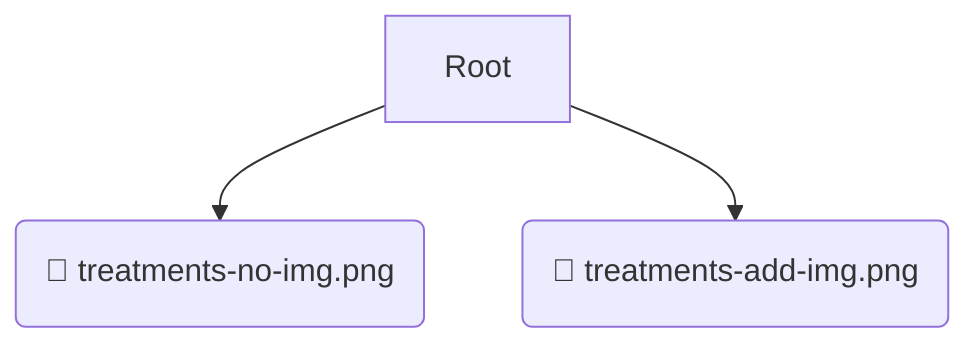

# 📂 images

*Breadcrumbs:* [frontend](/frontend) / [public](/frontend/public) / [images](/frontend/public/images)

## 🎯 PURPOSE
This directory `images` is an integral part of the Mavluda Beauty ecosystem. It contributes to the Angular zoneless, signal-based frontend.
This directory is meticulously maintained to uphold the 'Luxury Professional' standards of the Mavluda Beauty brand.

## 🏗️ ARCHITECTURE


## 📄 FILE REGISTRY
| File Name | Type | Responsibility | Key Aliases Used |
|---|---|---|---|
| `treatments-no-img.png` | `png` | Core functionality | `None` |
| `treatments-add-img.png` | `png` | Core functionality | `None` |

## 🔗 DEPENDENCIES
- No significant internal/external dependencies found.

## 🛠️ USAGE
```typescript
// Example placeholder for interacting with the images module
import { example } from './treatments-no-img.png';
```
