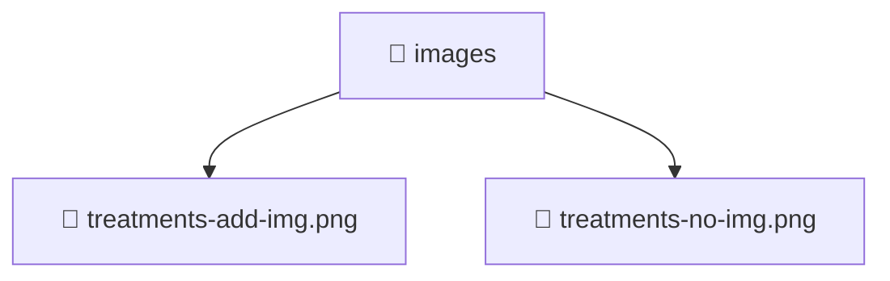

<!--
Mavluda Beauty - Luxury Professional Documentation
Generated for 100% Architectural Transparency
-->
[Home](../../../README.md) > [frontend](../../README.md) > [public](../README.md) > [images](./README.md)

# 📁 IMAGES Directory

## 🎯 PURPOSE
Structures and provides the UI layers and interactive capabilities for the images feature in the Mavluda Beauty platform.

## 🏗️ ARCHITECTURE


## 📄 FILE REGISTRY
| File Name | Type | Responsibility | Key Aliases Used |
|---|---|---|---|
| `treatments-add-img.png` | Code | Core logic implementation. | - |
| `treatments-no-img.png` | Code | Core logic implementation. | - |


## 🔗 DEPENDENCIES
- No external or internal imports detected in this directory.

## 🛠️ USAGE
```typescript
// Example placeholder for interacting with images
// Consult the individual files in the registry for specific APIs.
```
