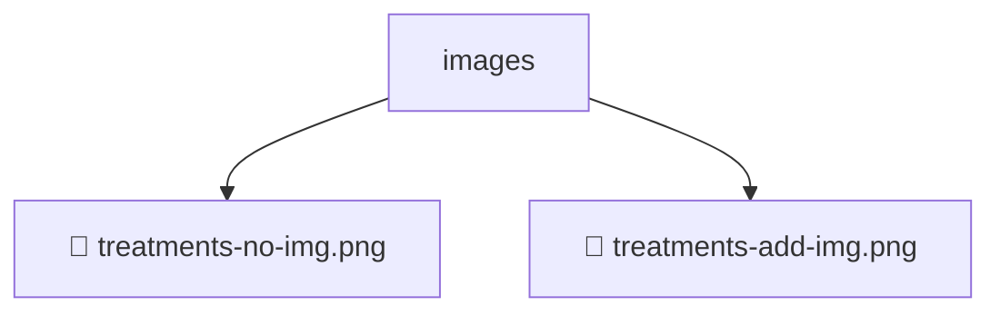

# 📂 IMAGES

> 💎 **Mavluda Beauty - Luxury Professional Architecture**

### 📍 Breadcrumb Navigation
`. > frontend > public > images`

## 🎯 PURPOSE
This directory encapsulates `General` level functionality within the Mavluda Beauty ecosystem, ensuring proper separation of concerns and architectural transparency.

**FSD / Architecture Layer:** `General`

## 🏗️ ARCHITECTURE


## 📄 FILE REGISTRY

| Item Name | Type | Responsibility | Key Aliases Used |
|-----------|------|----------------|------------------|
| `📄 treatments-no-img.png` | `.png` | General functionality | `None` |
| `📄 treatments-add-img.png` | `.png` | General functionality | `None` |

## 🔗 DEPENDENCIES
No external/internal aliases used directly in these files.

## 🛠️ USAGE
```typescript
// Example usage context
// Refer to the specific files in this directory for exact export usage.
```
