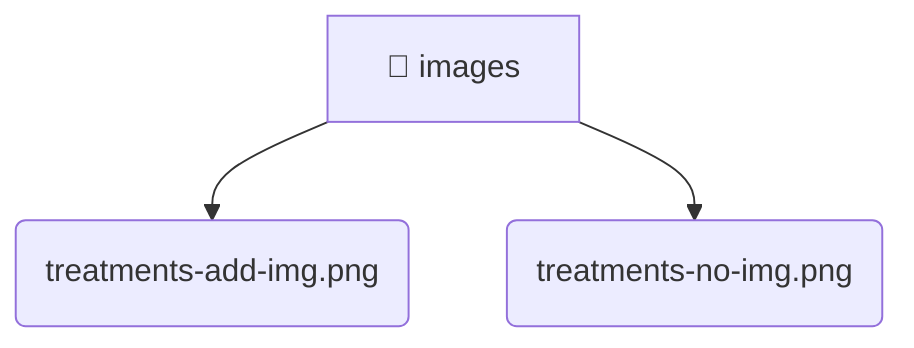

# [root](/) / [frontend](/frontend) / [public](/frontend/public) / [images](/frontend/public/images)

## 🏷️ 📁 Images

### 🎯 PURPOSE
The `images` directory handles frontend architecture and configuration for the Mavluda Beauty platform.

### 🏗️ ARCHITECTURE


### 📄 FILE REGISTRY
| File Name | Type | Responsibility | Key Aliases Used |
|---|---|---|---|
| `treatments-add-img.png` | `png` | Core logic or foundational asset for this directory. | None |
| `treatments-no-img.png` | `png` | Core logic or foundational asset for this directory. | None |

### 🔗 DEPENDENCIES
- `None`

### 🛠️ USAGE
```typescript
// Seamlessly integrate images into your refined workflows:
import { /* exported members */ } from '@path/to/images';
```
