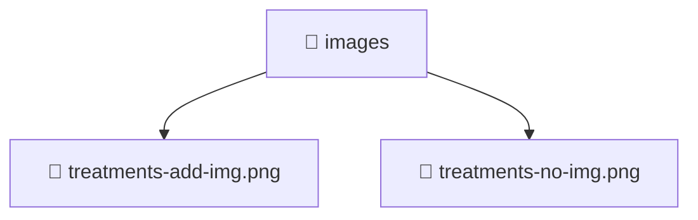

# 📁 images

[Root](/.) > [frontend](/frontend) > [public](/frontend/public) > [images](/frontend/public/images)

## 🎯 Purpose
Delivering luxury-tier architectural components and high-performance logic for the **images** domain. This directory is a crucial part of the Mavluda Beauty full-stack ecosystem, ensuring seamless scalability, robust performance, and an elite digital experience.

## 🏗️ Architecture


## 📄 File Registry
| File Name | Type | Responsibility | Key Aliases Used |
|---|---|---|---|
| `treatments-add-img.png` | File | Provides core logic and orchestration for treatments-add-img.png. | N/A |
| `treatments-no-img.png` | File | Provides core logic and orchestration for treatments-no-img.png. | N/A |

## 🔗 Dependencies
- No external dependencies.

## 🛠️ Usage
```typescript
// Example usage within the Mavluda Beauty ecosystem
import { relevantMember } from './images';

// Integrate into the application architecture
relevantMember.execute();
```
