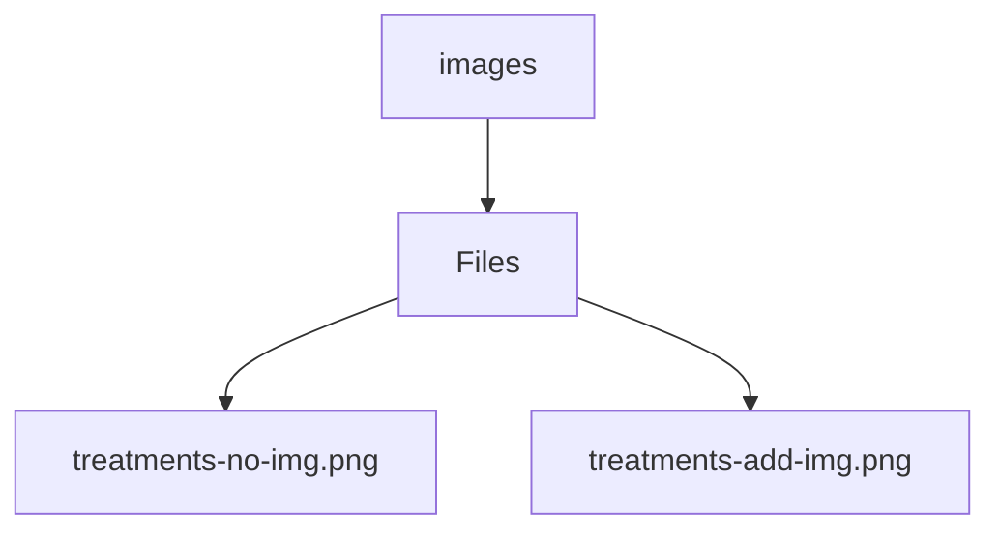

# 🏷️ Images Directory

> *Elegance, Precision, and Luxury Professionalism — The Mavluda Beauty Standard.*

## 🧭 Breadcrumb Navigation
[frontend](/frontend) ➔ [public](/frontend/public) ➔ [images](/frontend/public/images)

## 🎯 Purpose
This directory encapsulates the essential architecture and logic for the **Images** domain within the Mavluda Beauty ecosystem. It serves as a foundational component ensuring robust, scalable, and elegant operations.

## 🏗️ Architecture


## 📄 File Registry
| File Name | Type | Responsibility | Key Aliases Used |
|---|---|---|---|
| `treatments-no-img.png` | File | Defines logic and structure for treatments-no-img.png. | None |
| `treatments-add-img.png` | File | Defines logic and structure for treatments-add-img.png. | None |

## 🔗 Dependencies
No external or cross-module dependencies detected.

## 🛠️ Usage
```typescript
// This directory primarily serves organizational or static purposes.
// Reference its contents dynamically based on your feature requirements.
```
