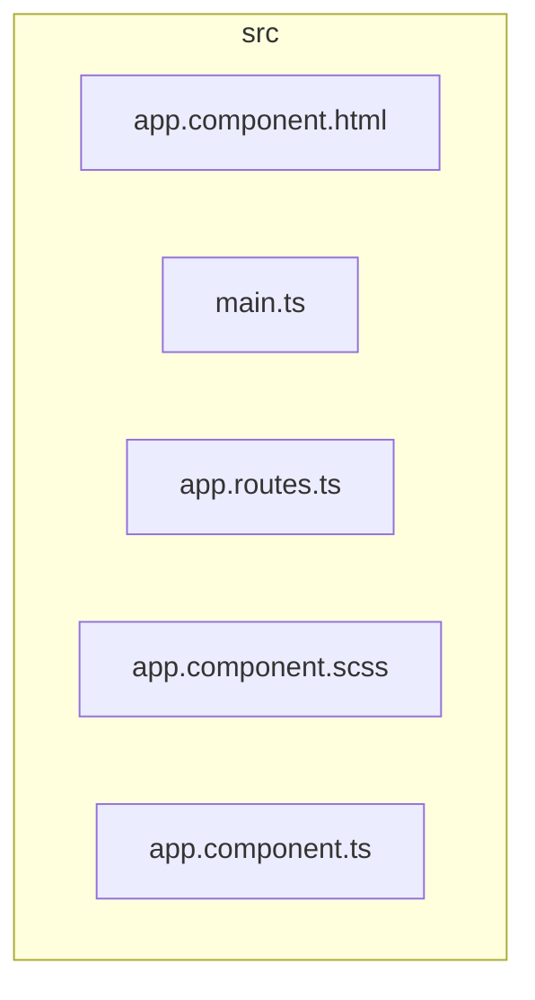

# 📂 src

[frontend](../README.md) > [src](README.md)

---

### 🎯 PURPOSE
Elevating the digital experience for the Mavluda Beauty ecosystem, this module manages the sophisticated Root / Operational Layer operations.

*FSD Layer:* **Root / Operational Layer**

---

### 🏗️ ARCHITECTURE



---

### 📄 FILE REGISTRY
| File Name | Type | Responsibility | Key Aliases Used |
|-----------|------|----------------|------------------|
| `app.component.html` | Template | Handles template logic for Mavluda Beauty's luxury standards. | `None` |
| `main.ts` | Source | Handles source logic for Mavluda Beauty's luxury standards. | `@angular` |
| `app.routes.ts` | Source | Handles source logic for Mavluda Beauty's luxury standards. | `@angular` |
| `app.component.scss` | Styles | Handles styles logic for Mavluda Beauty's luxury standards. | `None` |
| `app.component.ts` | Component | Handles component logic for Mavluda Beauty's luxury standards. | `@shared, @angular` |

---

### 🔗 DEPENDENCIES
**Key Path Aliases Detected:** `@shared`, `@angular`

Notable imports:
- `@shared/ui`
- `@angular/core`
- `./app.component`
- `@angular/platform-browser`
- `./app/app.config`
- `@angular/common`
- `@shared/services`
- `@angular/router`

---

### 🛠️ USAGE
To interact with this directory's luxurious logic, integrate its exported components or services directly into your feature modules. Ensure strict adherence to the Root / Operational Layer boundaries.

```typescript
// Example integration snippet
import { FeatureModule } from '@path/to/src';
```
